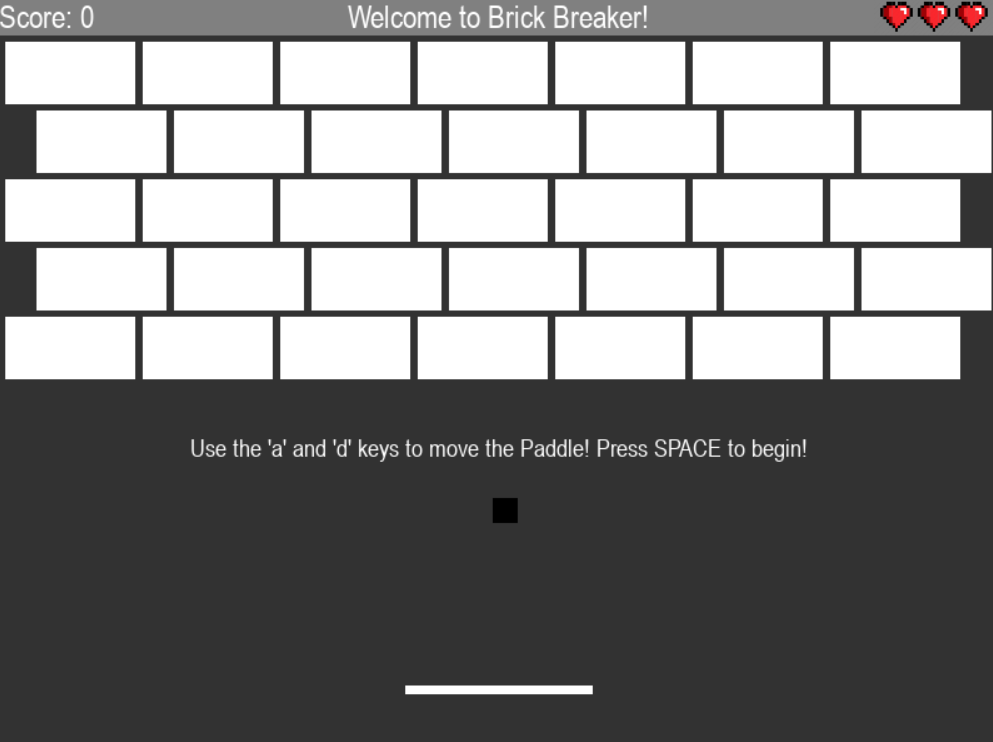
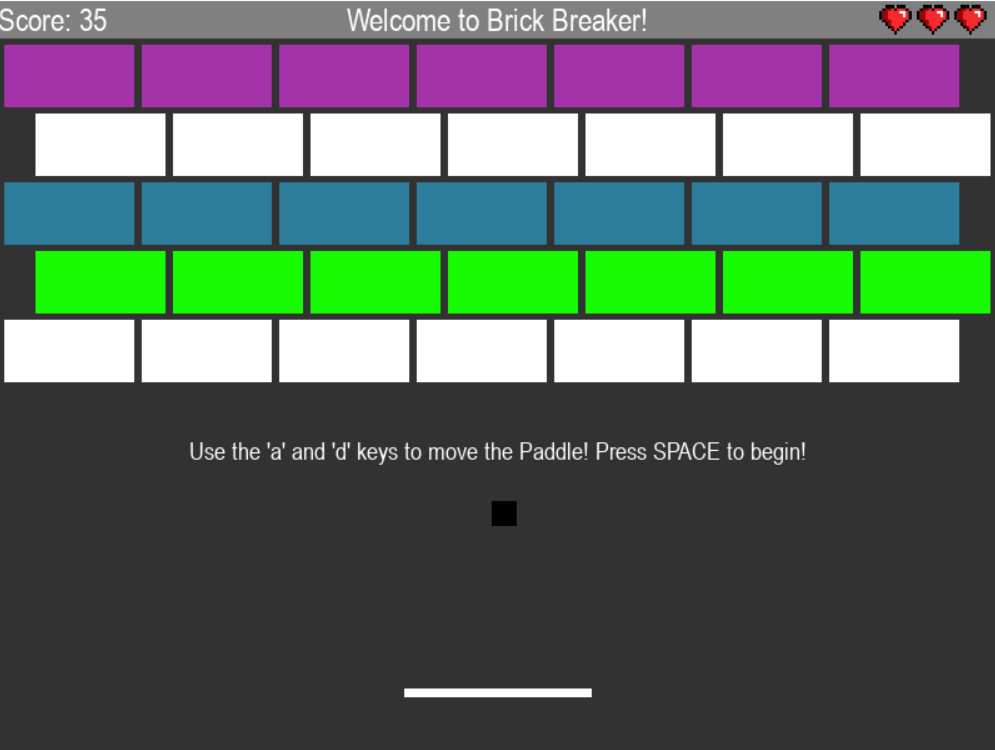
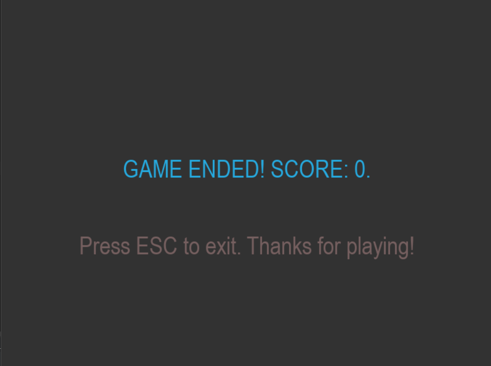
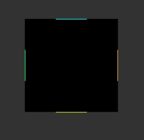

# CSE3130_MultiDay_Project_Brick_Breaker

## Program Description:

This is my CSE3130 Multiday Brick Breaker Project. This project is the classic Brick Breaker Game consisting of two levels. 

### First Level:

Below is the image of the first level (starting level of the program). On the top left, there is a score counter, which goes up by 1 each time a brick is hit. On the top right, there are three hearts. Each heart represents a "life" that the user has. If the ball goes past the paddle, meaning the user misses the ball, the user looses one heart. There are three hearts, representing three lives that the user has. This means that the user can miss the ball three times, and each time they will lose a heart. If the user misses the ball and there are no hearts remaining on the top right, that means that all lives have already been used up and the game ends. 

To start the game, the user must press SPACE. Once SPACE is pressed, the game will start. The user can use the 'A' and 'D' keys to move the paddle left and right and the direction of the ball will match the direction of the user. This means that if the ball is coming from the right and the user moves the paddle left, the ball will continue left. If the user moves the paddle right however, then the ball will go right, back in the direction it came from. 

Once all the bricks have been broken in the first level, the user progresses to the second level. It is to be noted that the three lives the user gets are carried through, meaning that if the user loses one life on the first level, then they will only have two lives remaining on the second level. This is done intentionally to ensure that the game does not get too easy (and possibly boring) for the user. 

### Second Level: 

Below is the image of the second level. The rules from the first level continue in this level as well, but this level is meant to be a little more difficult and interesting for the user so there is one change. In this level, there are different color bricks. Each colored brick varies in strength, meaning it needs to be hit a certain amount of times for it to break. 

The white bricks are the normal bricks which only need to be hit once to break. The green bricks need to be hit twice to break. The cyan bricks need to be three times, and the purple bricks need to be hit four times. Each time a colored brick is hit, it demotes down by one color. This means that if a green brick is hit once, it will become a white brick. Once that brick is hit again, it will break. If the cyan brick is hit once, it will become a green brick. Then a white brick, and then eventually it will break. The purple brick will turn cyan on the first hit, and then green, then white, and then it will also eventually break. This is a classic break breaker feature that I have added to my game to make it more entertaining and engaging for the user. 

Another thing to consider is that if the corner of the ball hits a brick, it registers as a double-hit as two sides of the brick are being hit at once. This means that if the user skillfully gets a corner to hit a brick, they can break stronger bricks much faster.

### End Screen

The End Screen presents the Score the user got when the game was finished. From there, the user has can exit the program by either pressing ESC or closing the window. 

 

## Planning Image 

Below is a planning image that shows the hitboxes of the Ball object. There are four hitboxes on each side, and this is done so the ball knows which direction to go after it hits a brick. Originally, the hitboxes were the same width as the Ball's width. But through experimentation, I learned that the hitboxes work best when they are 1/3 the width of the Ball side width. The size of the Ball used in the game is 20, and at that size, this arrangement of hitboxes works well. 

## Feature List

#### Feature 1: Three Lives

This feature has been talked about in the Level 1 section. This feature gives the user three lives, with each life being taken away when the user misses the ball. The three lives are shown to the user using three pixelated, video-game hearts on the top right of the screen. This feature enhances the user experience by providing a more professional feel, and also keeping the authenticity of the classic game.

#### Feature 2: Colored Boxes

On the second level, the user is faced with boxes of different colors, each with a different strength. This is a feature that was also seen in the original game and makes the game more interesting and visually appealing for the user. 

#### Feature 3: Ball moves with Paddle Direction

This feature ensures that the balls X-Direction matches the direction that the paddle is going. This is a deliberately chosen feature added to ensure that the user has control over the ball. Sometimes, if there is only one box left, it may seem to the user that it is impossible to hit the box, but that is in fact not the case. EACH box CAN be hit with the ball, but the user will have to maneuver the ball using the paddle to accomplish this. This adds more thrill to the game play. 

## Program Instructions

This program uses the 'pygame' library. The user will need to install this library to run this program. More details on the library and its installation can be found here: https://www.pygame.org/wiki/GettingStarted 

This program consists of 7 files, but don't worry. The user will only need to run the 'main.py' file to use the program. The other files are for different classes to create objects for the game. The reason many files were used is to ensure readability and organization within the entire program. Once the user runs the 'main.py' file, the instructions on the screen will guide the user. The only inputs the user will need to press will be the 'A' and 'D' keys to move the paddle. 

